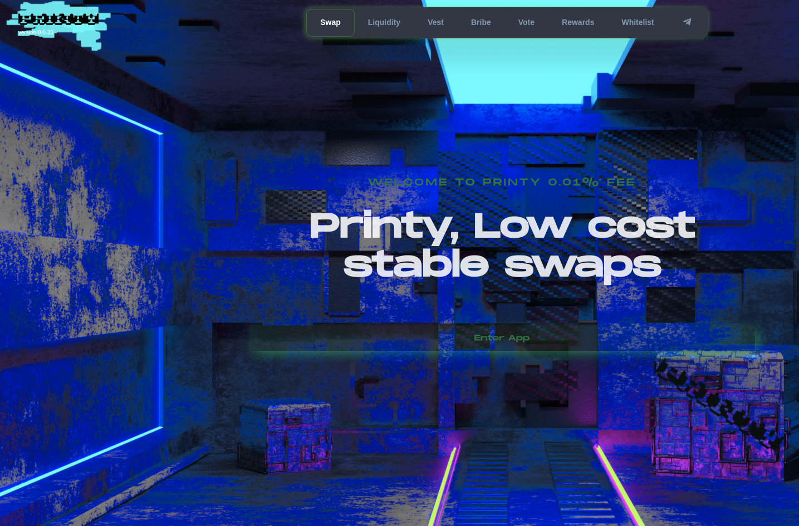

[](https://codecov.io/gh/andrecronje/solidly)


Solidly allows low cost, near 0 slippage trades on uncorrelated or tightly correlated assets. The protocol incentivizes fees instead of liquidity. Liquidity providers (LPs) are given incentives in the form of `token`, the amount received is calculated as follows;

* 100% of weekly distribution weighted on votes from ve-token holders

The above is distributed to the `gauge` (see below), however LPs will earn between 40% and 100% based on their own ve-token balance.

LPs with 0 ve* balance, will earn a maximum of 40%.

## AMM

What differentiates Solidly's AMM;

Solidly AMMs are compatible with all the standard features as popularized by Uniswap V2, these include;

* Lazy LP management
* Fungible LP positions
* Chained swaps to route between pairs
* priceCumulativeLast that can be used as external TWAP
* Flashloan proof TWAP
* Direct LP rewards via `skim`
* xy>=k

Solidly adds on the following features;

* 0 upkeep 30 minute TWAPs. This means no additional upkeep is required, you can quote directly from the pair
* Fee split. Fees do not auto accrue, this allows external protocols to be able to profit from the fee claim
* New curve: x3y+y3x, which allows efficient stable swaps
* Curve quoting: `y = (sqrt((27 a^3 b x^2 + 27 a b^3 x^2)^2 + 108 x^12) + 27 a^3 b x^2 + 27 a b^3 x^2)^(1/3)/(3 2^(1/3) x) - (2^(1/3) x^3)/(sqrt((27 a^3 b x^2 + 27 a b^3 x^2)^2 + 108 x^12) + 27 a^3 b x^2 + 27 a b^3 x^2)^(1/3)`
* Routing through both stable and volatile pairs
* Flashloan proof reserve quoting

## token

**TBD**

## ve-token

Vested Escrow (ve), this is the core voting mechanism of the system, used by `BaseV1Factory` for gauge rewards and gauge voting.

This is based off of ve(3,3) as proposed [here](https://andrecronje.medium.com/ve-3-3-44466eaa088b)

* `deposit_for` deposits on behalf of
* `emit Transfer` to allow compatibility with third party explorers
* balance is moved to `tokenId` instead of `address`
* Locks are unique as NFTs, and not on a per `address` basis

```
function balanceOfNFT(uint) external returns (uint)
```

## BaseV1Pair

Base V1 pair is the base pair, referred to as a `pool`, it holds two (2) closely correlated assets (example MIM-UST) if a stable pool or two (2) uncorrelated assets (example FTM-SPELL) if not a stable pool, it uses the standard UniswapV2Pair interface for UI & analytics compatibility.

```
function mint(address to) external returns (uint liquidity)
function burn(address to) external returns (uint amount0, uint amount1)
function swap(uint amount0Out, uint amount1Out, address to, bytes calldata data) external
```

Functions should not be referenced directly, should be interacted with via the BaseV1Router

Fees are not accrued in the base pair themselves, but are transfered to `BaseV1Fees` which has a 1:1 relationship with `BaseV1Pair`

### BaseV1Factory

Base V1 factory allows for the creation of `pools` via ```function createPair(address tokenA, address tokenB, bool stable) external returns (address pair)```

Base V1 factory uses an immutable pattern to create pairs, further reducing the gas costs involved in swaps

Anyone can create a pool permissionlessly.

### BaseV1Router

Base V1 router is a wrapper contract and the default entry point into Stable V1 pools.

```

function addLiquidity(
    address tokenA,
    address tokenB,
    bool stable,
    uint amountADesired,
    uint amountBDesired,
    uint amountAMin,
    uint amountBMin,
    address to,
    uint deadline
) external ensure(deadline) returns (uint amountA, uint amountB, uint liquidity)

function removeLiquidity(
    address tokenA,
    address tokenB,
    bool stable,
    uint liquidity,
    uint amountAMin,
    uint amountBMin,
    address to,
    uint deadline
) public ensure(deadline) returns (uint amountA, uint amountB)

function swapExactTokensForTokens(
    uint amountIn,
    uint amountOutMin,
    route[] calldata routes,
    address to,
    uint deadline
) external ensure(deadline) returns (uint[] memory amounts)

```

## Gauge

Gauges distribute arbitrary `token(s)` rewards to BaseV1Pair LPs based on voting weights as defined by `ve` voters.

Arbitrary rewards can be added permissionlessly via ```function notifyRewardAmount(address token, uint amount) external```

Gauges are completely overhauled to separate reward calculations from deposit and withdraw. This further protect LP while allowing for infinite token calculations.

Previous iterations would track rewardPerToken as a shift everytime either totalSupply, rewardRate, or time changed. Instead we track each individually as a checkpoint and then iterate and calculation.

## Bribe

Gauge bribes are natively supported by the protocol, Bribes inherit from Gauges and are automatically adjusted on votes.

Users that voted can claim their bribes via calling ```function getReward(address token) public```

Fees accrued by `Gauges` are distributed to `Bribes`

### BaseV1Voter

Gauge factory permissionlessly creates gauges for `pools` created by `BaseV1Factory`. Further it handles voting for 100% of the incentives to `pools`.

```
function vote(address[] calldata _poolVote, uint[] calldata _weights) external
function distribute(address token) external
```

### veNFT distribution recipients

| Name | Address | Qty |
| :--- | :--- | :--- |

### Testnet deployment

| Name | Address |
| :--- | :--- |
| wFTM| [0x27Ce41c3cb9AdB5Edb2d8bE253A1c6A64Db8c96d](https://testnet.ftmscan.com/address/0x27Ce41c3cb9AdB5Edb2d8bE253A1c6A64Db8c96d#code) |
| USDT| [0x8ad96050318043166114884b59E2fc82210273b3](https://testnet.ftmscan.com/address/0x8ad96050318043166114884b59E2fc82210273b3#code) |
| MIM | [0x976e33B07565b0c05B08b2e13AfFD3113e3D178d](https://testnet.ftmscan.com/address/0x976e33B07565b0c05B08b2e13AfFD3113e3D178d#code) |
| Solid | [0x0DB76C03fFF8F9f8d6600ca1f9aC004FDB73d442](https://testnet.ftmscan.com/address/0x0DB76C03fFF8F9f8d6600ca1f9aC004FDB73d442#code) |

| Name | Address |
| :--- | :--- |
| BaseV1Factory | [0x7dbA586e00D868EeFA13fC549B63D62b4a45a244](https://testnet.ftmscan.com/address/0x7dbA586e00D868EeFA13fC549B63D62b4a45a244#code) |
| BaseV1BribeFactory | [0xEc41c3165bc34eb5BDC66043FE3ac14617e4121c](https://testnet.ftmscan.com/address/0xEc41c3165bc34eb5BDC66043FE3ac14617e4121c#code) |
| BaseV1GaugesFactory | [0x3CE2B6952be35024411F6dE5A8626aA052E81C06](https://testnet.ftmscan.com/address/0x3CE2B6952be35024411F6dE5A8626aA052E81C06#code) |
| BaseV1Router01 | [0xD1D173c5d1de3175B32d3dDCB265BD00Ea9fEDf5](https://testnet.ftmscan.com/address/0xD1D173c5d1de3175B32d3dDCB265BD00Ea9fEDf5#code) |
| BaseV1Voter | [0xDA0eBF84F7A52A06EaeB0409F139D6442262F056](https://testnet.ftmscan.com/address/0xDA0eBF84F7A52A06EaeB0409F139D6442262F056#code) |
| veNFT | [0x74a91F1cEe46A20f5a15183aB54AEe89b015C21f](https://testnet.ftmscan.com/address/0x74a91F1cEe46A20f5a15183aB54AEe89b015C21f#code) |
| veNFT-dist | [0xACCF9d3b4084f85540D24e0aad0bE2c5F13BCDE2](https://testnet.ftmscan.com/address/0xACCF9d3b4084f85540D24e0aad0bE2c5F13BCDE2#code) |
| BaseV1Minter | [0x17C2074bb32d2B532ab479b6815ca1B50ff00024](https://testnet.ftmscan.com/address/0x17C2074bb32d2B532ab479b6815ca1B50ff00024#code) |

### Mainnet

| Name | Address |
| :--- | :--- |
| WAVAX| [0xB31f66AA3C1e785363F0875A1B74E27b85FD66c7](https://snowtrace.io/address/0xB31f66AA3C1e785363F0875A1B74E27b85FD66c7#code) |
| Print | [0x888365Cef16Baf8354Bf1A9A88e548555b7348bF](https://snowtrace.io/address/0x888365Cef16Baf8354Bf1A9A88e548555b7348bF#code) |
| BaseV1Factory | [0xc62Ca231Cd2b0c530C622269dA02374134511a36](https://snowtrace.io/address/0xc62Ca231Cd2b0c530C622269dA02374134511a36#code) |
| BaseV1BribeFactory | [0xbE292b3b0fE6D624A6625250e449C4240c799F35](https://snowtrace.io/address/0xbE292b3b0fE6D624A6625250e449C4240c799F35#code) |
| BaseV1GaugesFactory | [0x3408422f63535EAb2eF5B199edecd0c6189Cc03a](https://snowtrace.io/address/0x3408422f63535EAb2eF5B199edecd0c6189Cc03a#code) |
| BaseV1Router01 | [0x6A8f98d7e34Fd214B428BFc68c9309Ea3C4Fc7F1](https://snowtrace.io/address/0x6A8f98d7e34Fd214B428BFc68c9309Ea3C4Fc7F1#code) |
| BaseV1Voter | [0x47a3931486a73314D367e4dE2B2FfaC83fa4B81E](https://avascan.info/blockchain/c/address/0x3197713056b8E7358a31E0EC22A1450a6ad18b7d/contract) |
| veNFT | [0x3197713056b8E7358a31E0EC22A1450a6ad18b7d](https://snowtrace.io/address/0x3197713056b8E7358a31E0EC22A1450a6ad18b7d#code) |
| veNFT-dist | [0xFf58CD1a1394A19Efa33F83545081459dfE2dA44](https://snowtrace.io/address/0xFf58CD1a1394A19Efa33F83545081459dfE2dA44#code) |
| BaseV1Minter | [0xB733C89e9026Cf9e3aB07F85DCd3579bd135f603](https://snowtra

## Security

- [Immunefi Bug Bounty Program](https://immunefi.com/bounty/solidly/)  

* [MythX: voter.sol](https://github.com/andrecronje/solidly/blob/master/audits/17faf962f99a7e7e3f26f8bc.pdf)
* [MythX: ve.sol](https://github.com/andrecronje/solidly/blob/master/audits/4094394a6bc512d57672533c.pdf)
* [MythX: gauges.sol](https://github.com/andrecronje/solidly/blob/master/audits/4212b799deea3d9dd8f8620e.pdf)
* [MythX: core.sol](https://github.com/andrecronje/solidly/blob/master/audits/79effbd69276f2d16698b72d.pdf)
* [MythX: minter.sol](https://github.com/andrecronje/solidly/blob/master/audits/dea98051d23c85bcaa80dc5a.pdf)
* [PeckShield](https://github.com/andrecronje/solidly/blob/master/audits/e456a816-3802-4384-894c-825a4177245a.pdf)
